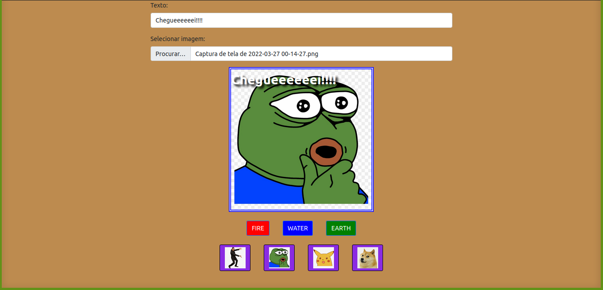

# Boas vindas ao repositório do projeto Meme Generator!

### Veja a aplicação em: https://meme-generator-three-puce.vercel.app/

---

# Sumário

- [Habilidades](#habilidades)
- [Entregáveis](#entregáveis)
  - [O que foi desenvolvido](#o-que-deverá-ser-desenvolvido)
  - [Desenvolvimento](#desenvolvimento)

# Habilidades

- Manipular o DOM.

- Manipular o Javascript.

- Manipular o CSS.

---

# Entregáveis

## O que foi desenvolvido

- Um site onde é possível fazer o upload de fotos para memes.

---

## Desenvolvimento

- Desenvoler uma aplicação usando HTML, CSS e JAVASCRIPT onde seja possivel fazer upload de imagens e a inserção de um texto sobre ela, estilizado de forma apropriada.

 **Em outras palavras, um meme generator.** 😜

---

  * [Javascript.com](http://javascript.com/)

  * [W3Schools](https://www.w3schools.com/js/default.asp)

  * [MDN](https://developer.mozilla.org/pt-BR/docs/Web/JavaScript)

  * [StackOverflow](https://pt.stackoverflow.com/questions/tagged/javascript)